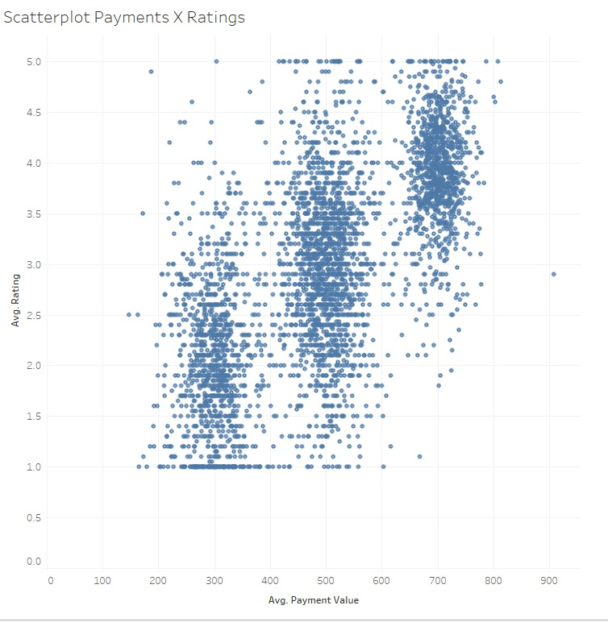
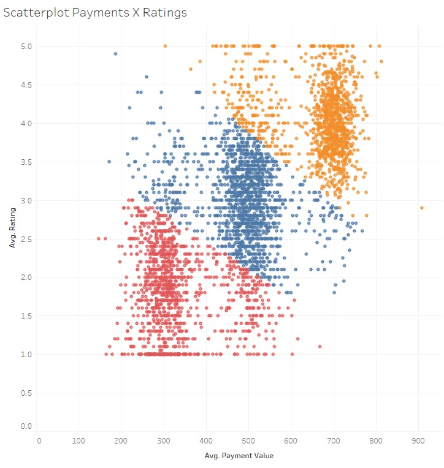

# faker-cluster-tableau
Repository created based on a project developed for a Data Visualization course at George Brown College.

## Overview
This project demonstrates how we can use Python, pandas and the [Faker](https://faker.readthedocs.io/en/master/) library to generate artificial datasets with some trends, such as clusters that can be visualized with the help of a data viz tool like Tableau.

## Requirements
- Python
- Jupiter notebook
- Tableau

## Generating cluster data
Please read the explanations provided in the [generage_clusters.ipynb](generate_clusters.ipynb) notebook.
The original data source, as well as the logic behind the clusters is documented in the notebook.

## Visualizing the clusters in Tableau
In the [faker-cluster-tableau.twbx](faker-cluster-tableau.twbx) file you can find an example of a simple scatterplot constructed using the output data, and you can clearly visualize the 3 clusters that were inteded.

We also attempt to use the automatic clustering in tableau, but the results are not very intuitive.

Maybe the clustering method being applied is not ideal, or the method is being applied over a different method of aggregation (to construct the scatterplot, we use average for both payments and ratings per customer, not sum).

Another interesting extension of this project would be using [tabpy](https://www.tableau.com/developer/tools/python-integration-tabpy) to generate the clusters and see if the results are more aligned with what was expected.